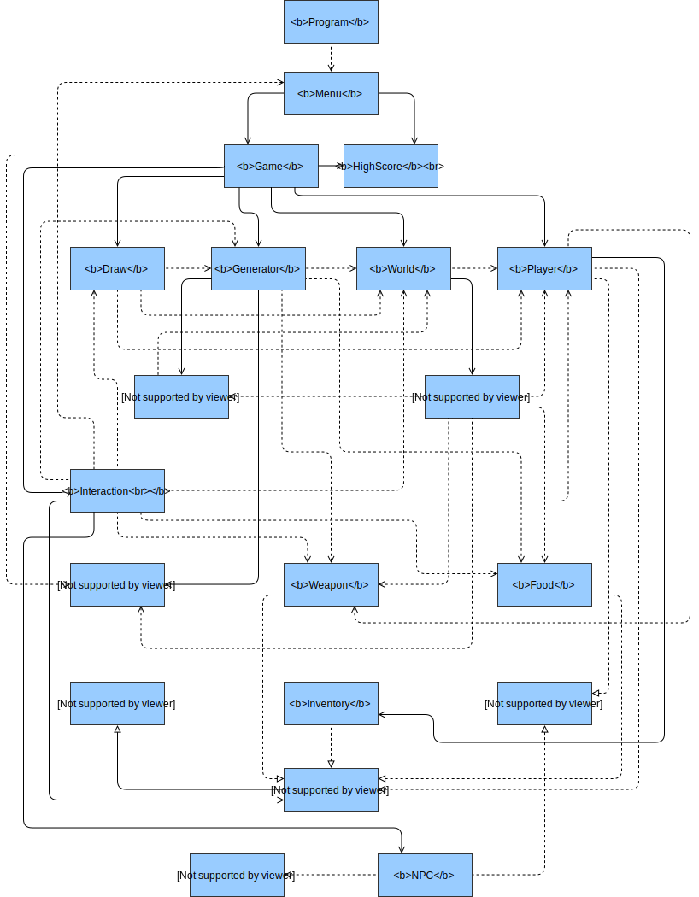

# RogueLike

## Autores

* Flávio Santos - 21702344

* Leandro Brás - 21701284

* Sara Gama - 21705494

## Repositório Remoto Usado

### [RogueLike](https://github.com/xShadoWalkeR/roguelike-LSF)

## Repartição do Projeto

O objetivo neste projeto foi sempre ninguém ficar para trás. Todo o código foi feito em grupo, embora por razões óbvias tenha havido repartições deste pelos membros constituintes.

#### Flávio
* Fase 1
* Diagrama UML
* Relatório

#### Leandro
* Fase 2
* Fase 4
* Fase 5
* Fase 7
* Fase 8
* Fase 9

#### Sara
* Fase 3
* Fase 6
* Fase 10
* Fluxograma

## Descrição da Solução

### Explicação

O projeto é composto por 17 classes (16 criadas por nós), 3 interfaces e 1 enumeração.

A primeira interface (`IHasHp`) contém apenas uma propriedade auto implementada (`Hp`) que representa a vida da personagem jogável e NPCs.
A segunda interface (`IHasWeight`) contém também apenas uma propriedade auto implementada (`Weight`) que será o peso aplicado a itens que o tenham.
A terceira interface (`IStuff`) implementa `IHasWeight` e é vazia, servindo como base para certas classes que representem/criem itens com um peso. É também fundamental na criação de certas listas.

Quando o projeto é iniciado a primeira coisa que faz é definir a codificação da consola como UTF-8, de forma a esta poder desenhar os símbolos usados para os vários itens no jogo. É também definido o tamanho da consola através do método `SetWindowSize()`, ficando esta com 120 por 50 de espaço de carateres. Após isto é feita uma chamada do método `DrawMenu()` pertencente à classe `Menu` (pois esta é `static`), que irá criar uma instância da própria classe e desenhar o Menu Inicial. Este método chama por sua vez o método `Choice()` que contém um `switch` que, após ler o *input* do utilizador na consola, chama o método adequado (`GenerateWorld()` para gerar o mundo (após ter sido criado uma instância de `Game`), ou seja iniciar o jogo, `DisplayHighScores()` para desenhar os valores das 10 melhores pontuações atuais, `DisplayCredits()` para desenhar o nome dos autores do projeto e `Exit()` da classe `Environment` para fechar a consola; os valores respetivos de cada ação por parte do programa vão de 1 a 4).

No construtor da classe `Game` são criadas instâncias do Jogador, Mundo, Geração Aleatória (dos vários níveis), Desenho (de tudo presente no jogo) e das HighScores. Dentro desta mesma classe encontram-se ainda 4 métodos: `GenerateWorld()` que como o nome indica, gera o mundo aleatoriamente (mais os itens em cada tile), a saída de cada nível e o jogador (enquanto a vida do mesmo é maior que 0); `TileChecker()` que tem como função verificar se cada *Tile* tem uma ou mais armadilhas, tirando vida ao jogador quando este se encontra no mesmo *Tile* que a(s) armadilha(s), imprimindo uma `string` no caso deste morrer devido ao dano causado por esta(s);`NpcChecker()` que verifica o *Tile* do jogador e caso haja um `NPC` nessa posição e caso seja hostil, este ataca e imprime no ecrã a cida perdida por parte do jogador; `UpdatePlayer()` que faz com que o jogador se movimente pelo mundo criado e possa interagir com itens neste. Este método vai buscar o método `TileChecker()` sempre que o jogador se movimenta e no final é feito um *update* ao mundo, mostrando *Tiles* explorados conforme o jogador progride pelo nível.

A classe `Draw` possui um construtor vazio. Encontram-se presentes nesta classe 6 métodos. O método `DrawWorld()` desenha o mundo através de 2 `for`'s, construindo também um *header* que indica o número do nível atual.
O método `DrawStats()` desenha as estatísticas atuais do jogador (vida, item equipado e peso do inventário em percentagem) bem como uma legenda do que está presente no nível. O método `DrawMessages()` imprime o item presente em cada um dos lados do jogador bem como onde está presente; no caso de nada se encontrar nesses sítios, nada é imprimido (exceto a as localizações). São também impressas as opções indicando os botões a pressionar e as suas ações. O método `ItemInteraction()` imprime um "ecrã secundário" de quando o jogador (consegue e) pretende coletar algo. O método `FightInteraction()` imprime também um "ecrã secundário" de quando o jogador pretende batalhar um *NPC*.  Por último, o método `DrawInformation()` limpa o mundo e lê o ficheiro de texto 'Info.txt' linha a linha, imprimindo informações acerca de todos os itens presentes no jogo.

A classe `Generator` possui um construtor que cria uma instância de `Map` (item) chamando quatro métodos (pertencentes à própria classe) que servem para colocar aleatoriamente todos os itens existentes no jogo. Excetuando o método `PlaceTheMap()`, todos os outros leem as informações e características de cada tipo de comida, arma, ou armadilha, de ficheiros 'txt' (de início, possuíamos enumerações com os tipos de itens, mas por razões de *hard coding*, foi feita a alteração destes para ficheiros de texto).

A classe `Player` possui um construtor que admite um peso (`baseWeight`) e cria uma instância de `Inventory` com um peso máximo (de 2). Existem algumas propriedades auto implementadas (como a vida da jogador, o último movimento e ainda a última interação) e uma propriedade (`Weight`) que devolve o peso total do jogador, tendo em conta os itens que possui no inventário. Existe também um método `InventoryPercentage()` que como o nome indica simplesmente "traduz" o peso total para percentagem (com 2 casas decimais).

A classe `Tile` possui no seu topo 7 propriedades auto implementadas do tipo `string` (*readonly*), cada uma guardando o código Unicode pertencente a cada item no jogo (de forma a ser impresso um certo símbolo). Mais abaixo encontram-se mais duas propriedades auto implementadas, `Explored` e `Exit`, ambas do tipo `bool`. O construtor desta mesma classe possui apenas um `for` que adiciona 10 `null`'s ao fim da lista genérica `List<Object>` (visto que esta classe a implementa) de modo a poder contar os espaços a serem preenchidos por tiles (`~`). Existem ainda 4 métodos presentes na classe: `IEnumerable<Object>()` que retorna todos os itens da lista, `GetObjects<T>()` que retorna apenas itens da lista que sejam de um certo tipo, um `override` do método `ToString()` que retorna a `string` de todos os itens existentes no jogo e `DrawMe()` que desenha todos os itens, incluindo o mundo e se está ou não explorado.

A classe `HighScore` possui uma propriedade auto implementada do tipo `List<string>` que guarda as 10 melhores pontuações no jogo até ao momento. O seu construtor pergunta se o ficheiro 'scores.txt' (guardado na variável `filename`) existe; caso exista este é lido pelo programa, se não existir é criada uma nova lista de *highscores*. Esta classe possui ainda 2 métodos: `NewScore()`, que adiciona as *highscores* ao ficheiro , substituindo a última `string` neste e `DisplayHighScores()` que imprime os valores contidos na lista.

A classe `World` começa com duas propriedades auto implementadas (*readonly*) `Rows` e `Columns` que representam o número de linhas e colunas presentes no mundo do jogo [8x8]. De seguida existe a criação de um `array` bidimensional de `Tile`'s. No construtor desta classe existe a criação de uma instância de `Tile` de 8 por 8 (ou seja, `Rows` e `Columns`) e a chamada de 3 métodos presentes nesta mesma classe: `PopulateEmptyTiles()`, que percorre o `array` e preenche o mundo através de uma instância da classe `Tile`; `SpawnPlayer()`, que pega no jogador atual e o coloca numa linha aleatória da primeira coluna (a contar da esquerda); `GenerateExit()`, que gera a saída do nível numa linha aleatória na última coluna (também a contar da esquerda); por último `GenerateNpc()`, que gera um número aleatório de *NPC*'s colocando-os também numa posição aleatória (mas nunca onde o jogador faz *spawn*).

A classe `Food` implementa `IStuff`, indicando que estes itens terão um peso. Existem 3 propriedades auto implementadas (*readonly*) que definem um tipo (`Type`), um peso (`Weight`) e a recuperação de vida do personagem aquando do seu consumo (`Heal`). O seu construtor apenas aceita os mesmos 3 argumentos igualando-os às propriedades pertencentes à classe. Existe ainda um `override` do método `ToString()` que retorna a `string` do tipo de comida pretendido devolver por parte do programa.

A classe `Weapon`, tal como a anterior, implementa `IStuff`, indicando que também as armas terão um peso. Existem 4 propriedades auto implementadas (*readonly*) que definem um peso (`Weight`), um poder de ataque (`AttackPower`), uma durabilidade (`Durability`) e um tipo (`Type`). O construtor desta classe, tal como a classe `Food` aceita argumentos, associando-os depois às propriedades definidas anteriormente. Existe também um `override` do método `ToString()` que retorna o tipo de arma pretendido devolver pelo programa.

A classe `Trap` contém 2 propriedades auto implementadas `MyTrap` e `Damage`, correspondendo respetivamente ao tipo de armadilha e ao dano que cada uma poderá fazer. O construtor desta classe aceita uma `string` e um `int` que são associados às propriedades anteriormente referidas. Existe mais uma vez um `override` do método `ToString()` que retorna o tipo de armadilha a devolver pelo programa.

A classe `Map` contém um construtor vazio, tendo apenas mais um método `UseMap()`, que após a coleta de um mapa, percorre o mundo através de dois `for`'s revelando o mundo, ao colocar todos os `Tile`'s como explorados.

A classe `Inventory` implementa `List<IStuff>()` e `IStuff`. O seu construtor é vazio, aceitando como argumento um `int` que define o peso máximo do inventário. Existe ainda uma propriedade (*readonly*) `Weight` que determina um peso total do inventário ao somar os pesos dos itens que são adicionados/já foram adicionados e retorna esse peso total.

A classe `Interaction` contém 4 variáveis de instância dos tipos `World`, `Player`, `Draw` e `Generator`. O seu construtor aceita variáveis do mesmo tipo que as propriedades igualando-as (as variáveis e as propriedades). Existem ainda 5 métodos presentes nesta classe: `PickItems()`, que é responsável pela coleta de itens (um `foreach` percorre todos os itens no jogo e desenha o *header* de acordo com o item que se encontra na localização do jogador; se for comida ou arma, este simplesmente vai para o inventário; se for mapa, este desaparece dos *tiles*; se este adicionar um peso que fique superior àquele do máximo permitido no inventário, este não é adicionado e mantém-se nos *tiles*); `DropItems()`, que é responsável pela saída de itens do inventário do jogador (um `foreach` percorre todos os itens no inventário e desenha o *header* de acordo com os itens que lá se encontram; no caso de haver então itens, estes podem então ser removidos do inventário e colocados no `tile` atual do jogador); `UseItems`, que é responsável pelo uso dos itens no inventário (um `foreach` percorre todos os itens no inventário e desenha o *header* de acordo com os itens que lá se encontram; se o item for comida e a vida do jogador for menor que o seu máximo [`100`], então esta pode ser consumida de forma a regenerar vida, de acordo com as suas propriedades; no caso de ser arma, esta pode ser equipada no seu respetivo *slot*, de forma a poder ser usado pelo jogador); `Fight()`, que é responsável pelo combate presente no jogo (um `foreach` percorre os itens no jogo e desenha o *header* de acordo com o item que se encontra na localização do jogador; se o "item" for um *NPC* e se o seu tipo for `Hostile` é detetado como um inimigo, se for esse o caso, o jogador pode então atacar o *NPC* com retirando vida a este de acordo com o poder da arma em posse, existindo também a chance da arma se estragar e "partir"; e `Quit()`, que é responsável pelo término do jogo (imprimindo uma pergunta à qual o jogador poderá responder com sim [`y`] se quiser mesmo sair, ou não [`n`] se afinal mudar de ideias), forçando o jogador a voltar ao Menu Inicial (no caso do jogador querer iniciar um novo jogo, este poderá fazê-lo, mas o mundo será recriado).

A classe `NPC` além de ter várias variáveis de instância, também tem propriedades auto implementadas para a vida (`Hp`), o dano (`AttackPower`) e o tipo que fará *spawn* (`Type`). O seu construtor aceita um `int` e um `Random` e basicamente cria *NPC*'s de acordo com o nível, multiplicando a vida e o ataque pelos *multipliers* correspondentes. Existem ainda 2 métodos presentes nesta classe: o método `Randomize()` que além de gerar um tipo de *NPC* aleatoriamente , também lhe gera a vida e o poder aleatoriamente, de acordo com o nível atual. Este método é chamado pelo construtor de forma a poder gerar *NPC*'s aleatoriamente. O método `ToString()` retorna o *NPC* e as suas propriedades (no caso de ser hostil) de acordo com o seu tipo.

A enumeração `NPCType` contém ambos os tipos de *NPC*'s que podem aparecer no jogo (`Neutral` e `Hostile`).

### Diagrama UML

### Fluxograma

## Conclusões e Matéria Aprendida

A estruturação de classes é algo extremamente importante, muito realçado pela criação e desenvolvimento deste projeto. A divisão de tarefas pelas mesmas tem de ser algo que faça sentido, algo para o qual qualquer programador poderia olhar e imediatamente entender.

Algo também muito importante neste projeto foi a implementação de interfaces por certas classes e o quão ajudam na facilitação do uso do código (impedem repetição do mesmo e ajudam na ordenação).

O uso de ficheiros de texto também ajudam imenso na alteração de variáveis e implementação de *highscores* (e até na substituição de *strings* extremamente compridas, como foi no caso das informações), onde um ficheiro simplesmente escreve por cima em vez de ter sempre de alterar as variáveis internamente no código.

As listas ficaram também bem marcadas na nossa cabeça como uma alternativa *arrays*, alternativa esta que é mais simples e facilitadora na leitura de código.

## Referências

Whitaker, RB. (2016). *C# Player's Guide*, Starbound Software
